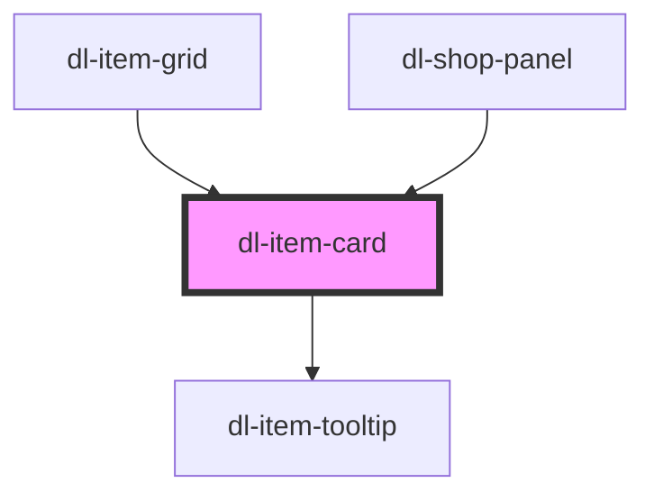

# dl-item-card

<!-- Auto Generated Below -->

## Properties

| Property        | Attribute         | Description                                                                          | Type                   | Default     |
| --------------- | ----------------- | ------------------------------------------------------------------------------------ | ---------------------- | ----------- |
| `hoverEffect`   | `hover-effect`    | Hover effect on the card. `"none"` does nothing, `"scale"` enlarges on hover.        | `"none" \| "scale"`    | `'none'`    |
| `itemClassName` | `class-name`      | Item class name (e.g. `"upgrade_clip_size"`). Alternative to `item-id`.              | `string \| undefined`  | `undefined` |
| `itemData`      | --                | Pre-loaded item data object. When provided, skips the API fetch.                     | `Item \| undefined`    | `undefined` |
| `itemId`        | `item-id`         | Item numeric ID. Alternative to `class-name`.                                        | `number \| undefined`  | `undefined` |
| `showTierBadge` | `show-tier-badge` | Show the tier badge on hover. When not set, falls back to the global provider value. | `boolean \| undefined` | `undefined` |

## Dependencies

### Used by

 - [dl-item-grid](../dl-item-grid)
 - [dl-shop-panel](../dl-shop-panel)

### Depends on

- [dl-item-tooltip](../dl-item-tooltip)

### Graph

----------------------------------------------

*Built with [StencilJS](https://stenciljs.com/)*
