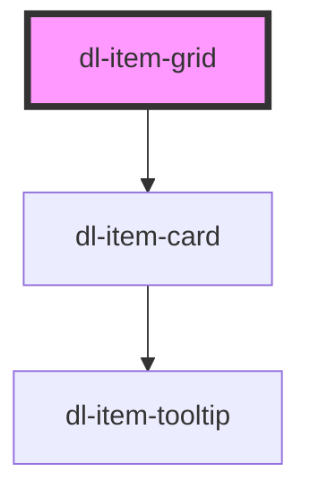

# dl-item-grid

<!-- Auto Generated Below -->

## Properties

| Property       | Attribute       | Description                                                         | Type                                              | Default     |
| -------------- | --------------- | ------------------------------------------------------------------- | ------------------------------------------------- | ----------- |
| `shopableOnly` | `shopable-only` | When `true`, only shows items available in the shop.                | `boolean`                                         | `true`      |
| `slotType`     | `slot-type`     | Filter items by slot type: `"weapon"`, `"vitality"`, or `"spirit"`. | `"spirit" \| "vitality" \| "weapon" \| undefined` | `undefined` |
| `tier`         | `tier`          | Filter items by tier (1–4).                                         | `1 \| 2 \| 3 \| 4 \| 5 \| undefined`              | `undefined` |

## Dependencies

### Depends on

- [dl-item-card](../dl-item-card)

### Graph

----------------------------------------------

*Built with [StencilJS](https://stenciljs.com/)*
