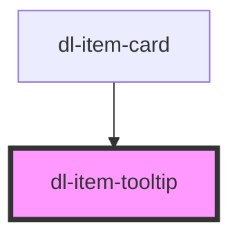

# dl-item-tooltip

<!-- Auto Generated Below -->

## Properties

| Property   | Attribute | Description                          | Type                | Default     |
| ---------- | --------- | ------------------------------------ | ------------------- | ----------- |
| `itemData` | --        | Item data to display in the tooltip. | `Item \| undefined` | `undefined` |

## Dependencies

### Used by

 - [dl-item-card](../dl-item-card)

### Graph

----------------------------------------------

*Built with [StencilJS](https://stenciljs.com/)*
