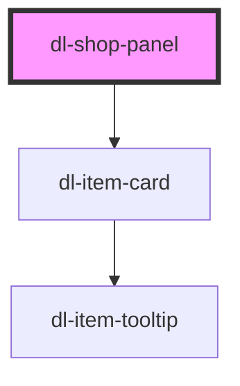

# dl-shop-panel

<!-- Auto Generated Below -->

## Properties

| Property      | Attribute      | Description                                                                   | Type                                 | Default    |
| ------------- | -------------- | ----------------------------------------------------------------------------- | ------------------------------------ | ---------- |
| `activeTab`   | `active-tab`   | The tab to display initially. One of `"weapon"`, `"vitality"`, or `"spirit"`. | `"spirit" \| "vitality" \| "weapon"` | `'weapon'` |
| `hoverEffect` | `hover-effect` | Hover effect applied to each item card. One of `"none"` or `"scale"`.         | `"none" \| "scale"`                  | `'scale'`  |

## Dependencies

### Depends on

- [dl-item-card](../dl-item-card)

### Graph

----------------------------------------------

*Built with [StencilJS](https://stenciljs.com/)*
